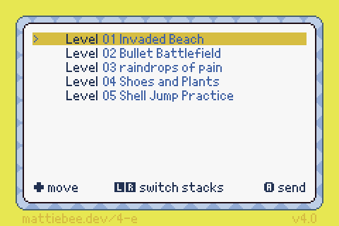
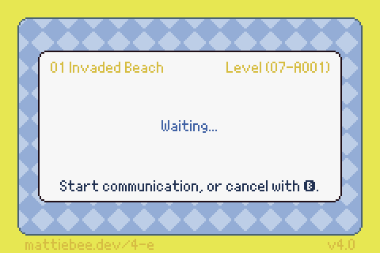

# 4-e

4-e sends [_Super Mario Advance
4_](https://www.mariowiki.com/Super_Mario_Advance_4:_Super_Mario_Bros._3)
[e-Reader cards](https://www.mariowiki.com/Super_Mario_Advance_4:_Super_Mario_Bros._3_e-Reader_cards) from the [Game
Boy Advance](https://en.wikipedia.org/wiki/Game_Boy_Advance) it's running on to another running _Mario_. It uses decoded .bin files of those cards' data instead of printed cards an an actual [e-Reader](https://www.mariowiki.com/E-Reader).





It can send level, power-up, and demo cards between real Game Boys Advance and [Analogue Pockets](https://www.analogue.co/pocket) using link cables. It can also send cards between [mGBA](https://mgba.io) multiplayer windows. No e-Reader or e-Reader ROM is required.

Need .bin files? The latest versions of the [Smaghetti](https://smaghetti.mattgreer.dev) editor for _Mario_ can save .bin files. Head to the flask icon in the lower-right corner of the editor to access Experiments—you can download your levels as .bin files there!

## Usage

### Building your ROM

Download the base "4-e.gba" ROM from [releases](https://github.com/mattieb/4-e/releases), or build it with [devkitARM](https://devkitpro.org/wiki/devkitARM).

Gather your cards in ".bin" format.

#### gbfs-web

The easiest way to attach cards is with gbfs-web](https://mattiebee.app/gbfs-web). Select your 4-e ROM, select your cards, and save a new 4-e ROM with the cards attached.

#### Command-line tool

You can also use the standard tools from [GBFS](https://pineight.com/gba/#gbfs) to create a GBFS file, then concatenate it to 4-e.gba. These tools are also included in the "gba-tools" package in devkitARM.

```shell
gbfs cards.gbfs *.bin
cat 4-e.gba cards.gbfs >"4-e with Cards.gba"
```

If you have a lot of cards, since v3.0 you can also attach _multiple_ GBFS files and treat them as "stacks" you can page through.

> [!NOTE]
> Each GBFS file must be padded to 256 bytes for this to work correctly. You can use the "padbin" tool available in the GBFS distribution or devkitARM to do this.

```shell
gbfs a.gbfs a/*.bin
padbin 256 a.gbfs
gbfs b.gbfs b/*.bin
padbin 256 b.gbfs
cat 4-e.gba a.gbfs b.gbfs >"4-e with Stacks.gba"
```

### Sending cards

1.  On one Game Boy Advance, run _Super Mario Advance 4_. Connect the player-1 end of a link cable to this system.

2.  On another Game Boy Advance, run the 4-e ROM [you built](#building-your-rom). Connect the player-2 end of the link cable to this system.

3.  Pick the e-Card you wish you send from the list. (If your GBFS file only had one e-Card in it, it will be selected automatically; you won't see the list.) 4-e says "Waiting..." 

    > [!NOTE]
    > From this point on, you can cancel and reset by pressing B.

4.  On the first system, start the e-Reader communication process. 4-e will connect to the game automatically and send your card, saying "Sending..."

5.  When 4-e has finished ("Done!"), press any button to reset it. Now you can send another card, if you wish!

## Troubleshooting

### Communication

If you're having communication issues, such as communication not starting or  check that your link cable is connected firmly and correctly.

-   If you're using the official Nintendo link cable, it must be connected with the purple end to the game and the gray end to 4-e.

-   If you're using the Analogue Pocket link cable, it must be switched to GBA mode, not GB/C mode. The end closest to the switch is player 1 (the _Mario_ end); the other end is player 2 (the 4-e end).

### Errors and strange behavior

If 4-e says

> No card data attached. See instructions.

check that you [built your ROM](#building-your-rom) correctly and that the built ROM is the one you launched on your Game Boy Advance.

If 4-e is behaving oddly, doesn't let you switch stacks (if you have more than one), or says

> Error reading card data. See instructions.

check that you've built and attached your GBFS files correctly.

[gbfs-web](#gbfs-web) does this for you. You shouldn't run into problems if you used this method.

If you're building [on the command line](#command-line-tool), make sure you've built and concatenated the GBFS file correctly and (if you're using multiple stacks) padded each file to 256 bytes.

## Thanks

4-e is built on, and takes inspiration from, all these projects and people:

- [devkitARM](https://devkitpro.org/wiki/devkitARM), the community-maintained toolchain to build it all.

- [gba-makefile-template](https://github.com/gbadev-org/gba-makefile-template), providing a solid base to build on.

- [Tonc and libtonc](https://gbadev.net/tonc/), the libraries supporting everything you see and interact with.

- [Usenti](https://www.coranac.com/projects/usenti/), the pixel editor made by Tonc's author, which I used to create the new "four" font used in v4.0.

- GBATEK (specifically the section on [GBA Communication Ports](https://problemkaputt.de/gbatek.htm#gbacommunicationports)), the definitive guide to how the GBA hardware works.

- [GBFS](https://pineight.com/gba/#gbfs), for providing a ready-made solution for bringing files to a system that has no filesystem.

- [mGBA](https://mgba.io) and especially its serial logging, which made it possible for me to black-box reverse-engineer the protocol _Mario_ used to talk to the e-Reader.

- The [GB Operator](https://www.epilogue.co/product/gb-operator), which dumped ROMs from my copy of _Mario_ and my e-Reader that I could use with mGBA.

- Super Mario Wiki and their [list of e-Reader cards](https://www.mariowiki.com/Super_Mario_Advance_4:_Super_Mario_Bros._3_e-Reader_cards), for information on the many cards I never saw in the US.

A _huge_ special thanks to the community over the past decades for digging into the e-Reader and _Super Mario Advance 4_. Without your work, I could _never_ have pulled this off.

And, of course, Nintendo. You didn't help any of us make _this_, but you did make the game I loved so much in the first place—inspiring me to see if I could take it further.
